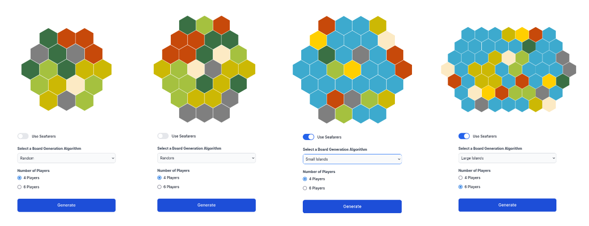

# Catan Randomiser JS

This repo contains a Next.js app that randomly generates Settlers of Catan board layouts based on a different randomisation
algorithms. The app is a modern version of the original Python Kivy repo which can be found
[here](https://github.com/stuart-bradley/Catan-Randomiser).

## Features

- Generates boards for the base game, as well as Seafarers and 6 player expansions.
- Allows the saving and sharing of boards via unique URLs.
  - These URLs can also be tweaked to modify the boards.
- Seafarers boards include a number of different randomisation algorithms to generate different geographical features.
- Responsive design for mobile.

## Screenshots



The colours correspond as follows:

- Wheat: 
- Sheep: 
- Rock: 
- Tree: 
- Brick: 
- Desert: 
- Gold: 
- Ocean: 

## Documentation

Full documentation can be found in the [documentation](documentation) folder.

## Dependencies

- [Next.js](https://nextjs.org/) `14.1.*`
- [React](https://react.dev/) `18.*`
- [react-hexgrid](https://github.com/Hellenic/react-hexgrid) `2.0.0@beta`
  - [emotion](https://emotion.sh/docs/introduction) `11.11.*` (dependency not imported by react-hexgrid)
- [Zod](https://zod.dev/) `3.22.*`

### Dev Dependencies

- [Typescript](https://www.typescriptlang.org/) `v5.*`
- [Tailwind CSS](https://tailwindcss.com/) `v3.3.*`
- [ESLint](https://eslint.org/) `8.56.*`
- [Prettier](https://prettier.io/) `3.2.*`
- [pre-commit](https://pre-commit.com/) `3.5.*`
- [Vitest](https://vitest.dev/) `1.2.*`
- [Cypress](https://www.cypress.io/) `13.6.*`
- [start-server-and-test](https://github.com/bahmutov/start-server-and-test) `2.0.3`
- [testing-library/react](https://testing-library.com/docs/react-testing-library/intro) `14.2.*`
- [testing-library/user-event](https://testing-library.com/docs/user-event/intro) `14.5.*`

### Setup Guide

#### Development

Make sure you have [Node JS](https://nodejs.org/en), and [pre-commit](https://pre-commit.com/) installed on your system.

To setup for development the only commands that need to be run are:

```bash
npm install # Or Yarn etc, installs all required node dependencies.
pre-commit install # Installs hooks for ESLint and Prettier
```

For development, the following commands have been setup in `package.json`:

```bash
npm run dev # Runs the development server
npm run build # Creates the Production build
npm run start # Runs the Production server (requires a build)
npm run test # Runs Vitest Unit and Component tests
npm run cypress:open # Runs the Cypress E2E suite in the GUI
npm run cypress:ci # Runs the Cypress E2E suite in headless mode.
```

#### Production

For a Production setup, both a Dockerfile and Kubernetes (K8s) configuration have been included in the repo, and are
both ready for use with various cloud providers.

The image used by K8s can be found on Docker Hub [here](https://hub.docker.com/repository/docker/stuartbradley/catan-randomiser-js).

To test these locally the following commands can be used:

```bash
# Docker - Requires Docker Engine
docker build -t catan-randomiser-js .
docker run -p 3000:3000 catan-randomiser-js
# K8s - Requires Minicube or similar
kubectl apply -f kubernetes/deployment.yaml
kubectl apply -f kubernetes/service.yaml
# Either following command:
minikube service catan-randomiser-js
kubectl expose deployment catan-randomiser-js --type=LoadBalancer --port=3000
```
