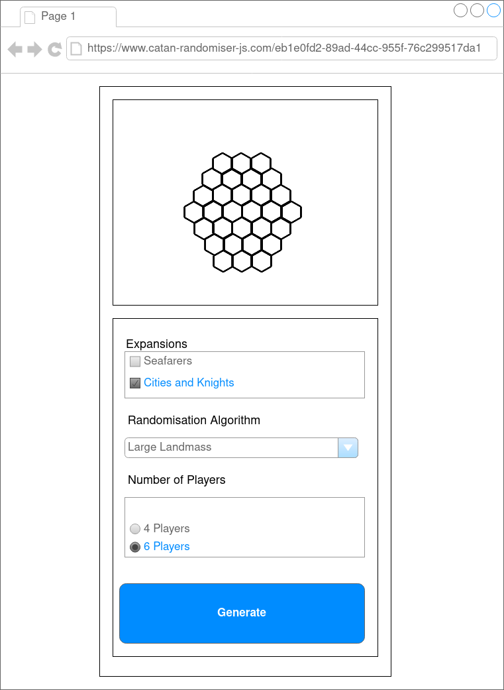

# Product Requirements Document (PRD)

This document outlines the high level requirements that this project needs to be considered feature complete for
Version 1.

## Description

The Catan Randomiser application should be a web application accessible over the internet that allows a user to generate
visual representations of a Settlers of Catan board for use when setting up the physical game.

## Competing Product Analysis

Settlers of Catan board generators are a relatively common product. Common enough to have an article
[ranking a number of them](https://howtoplaycatan.com/home/catan-map-generator/). Below is a comparison of the six listed:

| [The Better Catan Board Generator](https://catan.bunge.io/)      | [Catan Map Generator](https://alexbeals.com/projects/catan/)            | [Catan Map Generator (Standard and Expansion)](https://jkirschner.github.io/catan-randomizer/) | [Catan Board Generator](https://www.generatecatanboard.com/)     | [Catanerator](https://apps.apple.com/us/app/catanerator-map-generator/id439248947) | [Catanous](https://apps.apple.com/us/app/catanous-catan-map-generator/id943092940) |
| ---------------------------------------------------------------- | ----------------------------------------------------------------------- | ---------------------------------------------------------------------------------------------- | ---------------------------------------------------------------- | ---------------------------------------------------------------------------------- | ---------------------------------------------------------------------------------- |
| [ + ] Uses real Catan graphics (and has a colourblock mode)      | [ + ] Uses real Catan graphics                                          | [ + ] Uses real Catan graphics                                                                 | [ + ] Uses real Catan graphics                                   | [ + ] Includes dice tokens                                                         | [ + ] Includes dice tokens                                                         |
| [ + ] Includes dice tokens                                       | [ + ] Includes dice tokens                                              | [ + ] Includes dice tokens                                                                     | [ + ] Includes dice tokens                                       | [ + ] Has a 6 player mode                                                          | [ + ] Has a 6 player mode                                                          |
| [ + ] Has a 6 player mode                                        | [ + ] Allows placement of player pieces                                 | [ + ] Has a 6 player mode                                                                      | [ + ] Has a 6 player mode                                        | [ + ] Includes Seafarers                                                           | [ + ] Includes Seafarers (including scenarios)                                     |
| [ + ] Mobile responsive design                                   | [ + ] Allows for the sharing of boards                                  | [ - ] Does not include Seafarers                                                               | [ + ] Includes randomised harbours                               | [ + ] Includes randomised harbours                                                 | [ + ] Generated boards can be tweaked                                              |
| [ - ] Does not include Seafarers                                 | [ - ] Does not include Seafarers                                        | [ - ] Randomisation algorithm appears to be a simple tile picker                               | [ + ] Includes statistics about the board                        | [ + ] Algorithms for competitive play                                              | [ + ] Includes additional scenario maps specific to the app                        |
| [ - ] Randomisation algorithm appears to be a simple tile picker | [ - ] Does not include 6 players                                        | [ - ] Not a mobile responsive design                                                           | [ + ] Includes a Cities and Knights mode                         | [ + ] Mobile responsive design                                                     | [ + ] Algorithms for competitive play                                              |
|                                                                  | [ - ] Not a mobile responsive design                                    |                                                                                                | [ + ] Mobile responsive design                                   | [ - ] Iphone / Ipad only                                                           | [ + ] Mobile responsive design                                                     |
|                                                                  | [ ~ ] Multiple randomisation algorithms but its unclear how they differ |                                                                                                | [ - ] Does not include Seafarers                                 | [ ~ ] Only colour block graphics                                                   | [ + ] Colourblind mode                                                             |
|                                                                  |                                                                         |                                                                                                | [ - ] Randomisation algorithm appears to be a simple tile picker |                                                                                    | [ - ] Iphone / Ipad only                                                           |
|                                                                  |                                                                         |                                                                                                |                                                                  |                                                                                    |                                                                                    |

### Feature Discussion

- The majority of the applications appear to be missing Seafarers (all the web based ones), and randomisation
  algorithms to take advantage of the larger maps and possible geographies.
- Real Catan graphics (or stylised ones) are better for readability.
  - Colourblind mode is a nice accessibility feature.
- Dice tokens are probably unnecessary: it's easy to randomly pull these from the bag and apply house rules
  (such as no reds being adjacent).
- A mobile responsive web design means that the apps are usable by a much larger audience.
- Board tweaking may be a good feature for V2.

## User Stories

- US1: A user should be able to generate a Settlers of Catan board based on their physical setup (expansions,
  number of players, etc).
- US2: A user should be able to share generated boards via a unique URL that is generated for each board.
- US3: A user should be able to generate boards on a mobile device, or other screen sizes.

## Wireframe

The UI for this project should consist of an image of the final board, as well as a form that includes the following
fields:

1. Select which expansions a player has.
2. Select the randomisation algorithm (may change based on 1.).
3. Select the number of players.
4. A button to generate a new field.

This wireframe is missing the following functionality that should be included:

- Colour coding of the board, and a way for the user to determine how colours match to physical board pieces
  (e.g.) a legend or tooltips, etc.
